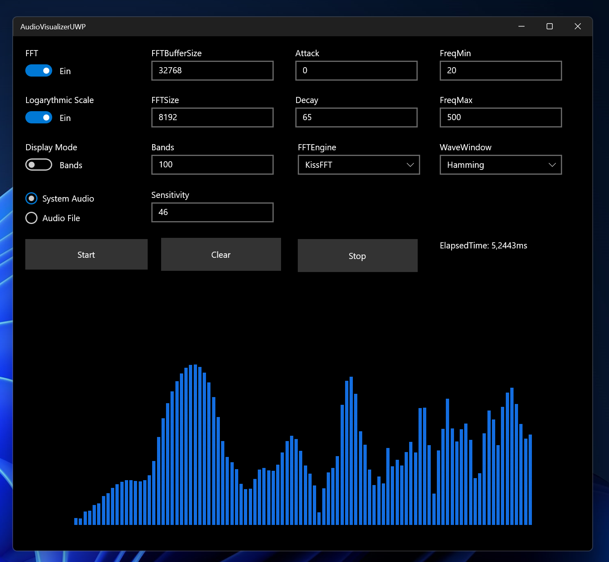

# AudioVisualizerUWP

AudioVisualizerUWP is a playground for Visualizing audio using a Frequency Specturm or a Waveform 

The Frequency analysis is done by a Fast-Fourier-Transform, which has different parameters that can be changed at runtime.

You can play around with the different parameters and observe their effect.

## Technologies used

 - ### WASAPI (Windows Audio Saession API) 
 - ### Microsoft XAML UI
 - ### C# 
 - ### .Net standard 2.0
 - ### Universal Windows Platform
 - ### Windows App SDK
 - ### KissFFT

## License
[MIT](https://choosealicense.com/licenses/mit/)